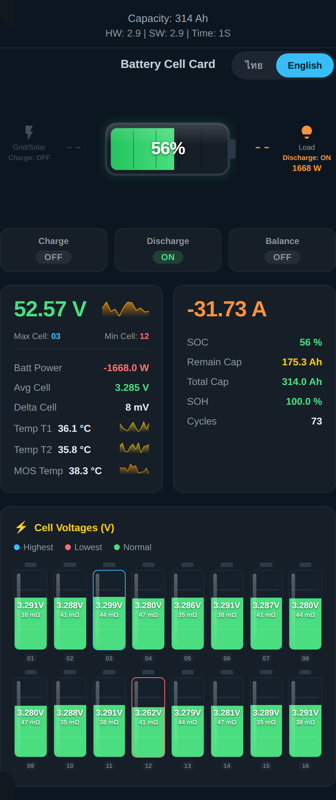
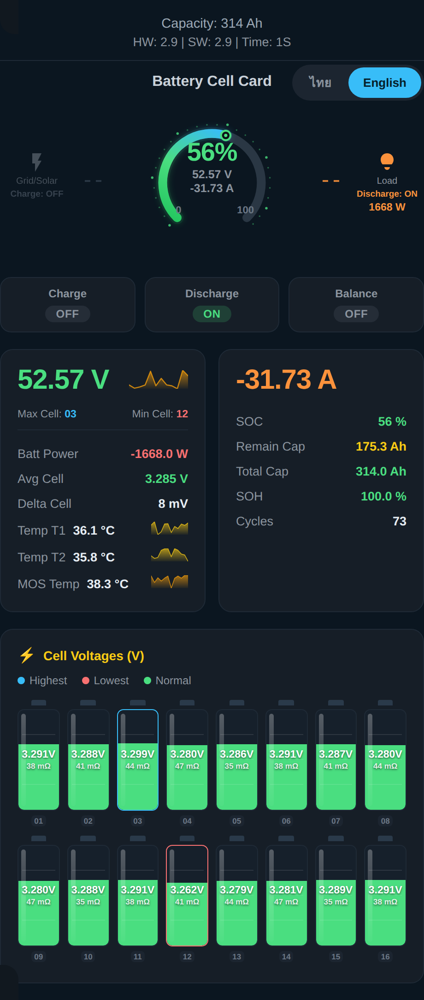

# Battery Cell Card

[](https://github.com/hacs/integration)
[](https://github.com/jingjoks/Battery-Cell-Card/releases)
[](LICENSE)

A Home Assistant Lovelace card for visualizing **BMS battery data**
(originally built for JK-BMS, works with any BMS that exposes the right
sensors): pack voltage/current, SOC/capacity, SOH, charging cycles,
temperatures with 6-hour sparkline trends, a Grid/Solar ↔ Load flow
display with live charge/discharge wattage, a Balance status
indicator, an optional header info bar (capacity, HW/SW version,
uptime), and a per-cell voltage display with automatic highlighting of
the highest/lowest cells. Built-in **Thai / English** language toggle.

Works with any integration that exposes BMS data as Home Assistant
sensors — JK-BMS BLE custom component, ESPHome (`syssi/esphome-jk-bms`),
Victron, Daly, Seplos, JBD, or your own ESP32/MQTT bridge. No hardcoded
entity names; you map your own entities in the card configuration.

## Screenshots

The card has **two** interchangeable styles for the center SoC display
and **two** for the per-cell voltage display — pick whichever fits
your dashboard, or switch any time via config (`center_style` and
`cell_list_style`). All examples below are the same card, same data —
just different style settings.

### Battery shape + horizontal list

`center_style: battery-shape` · `cell_list_style: list` (defaults)


### Battery shape + battery-shape cells

`center_style: battery-shape` · `cell_list_style: battery`



### Arc gauge + horizontal list

`center_style: arc` · `cell_list_style: list`


### Arc gauge + battery-shape cells

`center_style: arc` · `cell_list_style: battery`



**Center style:** a literal horizontal **battery-shape** icon (body +
terminal nub) with a gradient fill, faint segment divider lines, and a
glossy highlight, filling left-to-right with SoC% — or a **270° arc
gauge** with scale ticks, a pointer dot, a soft glow, and **SoC** large
in the middle with **voltage**/**current** underneath in smaller text.
Both are flanked by Grid/Solar (left) and Load (right) flow icons
connected to the gauge with dashed lines that light up and show live
wattage whenever that side is active.

**Cell display style:** a horizontal **list** of rows with voltage and
optional resistance as text — or a vertical **battery shape** icon per
cell (body + terminal nub, segment divider lines, glossy highlight),
with the voltage and resistance shown right inside the icon itself,
fill color reflecting voltage against `cell_min_voltage`/
`cell_max_voltage` (green/yellow/red), and the icon's border turning
blue/red for the highest/lowest cell in the pack.

## Features

- 🔋 Pack voltage, current, and power at a glance, each with a 6-hour
  sparkline trend pulled from Home Assistant's history
- 📊 SOC, remaining/total capacity, SOH, charging cycles
- 🌡️ Temperature sensors (T1, T2, MOS/power-tube) with sparklines
- ⭕ Center SoC visual — choose a literal **battery-shape** icon or a
  **270° arc gauge**, both with live Grid/Solar ↔ Load flow indicators
- 🔌 Grid/Solar and Load flow icons are connected to the center gauge
  with dashed lines that light up and show **live wattage** whenever
  that side is active — reads `entities.charge_status` /
  `discharge_status` when set (falls back to the sign of `current`
  otherwise), no extra entities required
- 🟢🟡🔴 The center SoC visual changes color based on charge level —
  green above 50%, yellow between 20–50%, red at 20% or below — across
  both center styles, no configuration needed
- ⭕ The **arc gauge** also shows voltage and current in smaller text
  underneath the SoC percentage, right inside the dial
- 🔋 **Charge / Discharge / Balance** status chips — up to three
  read-only chips in a row below the gauge, one per entity you set
  (`charge_status`, `discharge_status`, `balance_status`); the
  Charge/Discharge chips always agree with the flow icons since they
  read the same underlying status
- 🧾 Optional **header info bar** — battery label, total capacity,
  hardware/firmware version, uptime (uptime in raw seconds is
  automatically formatted as e.g. `18H 43M`)
- 🟢🟡🔴 Battery-shape cells are colored by actual cell voltage against
  your configured min/max scale — green when high, yellow in the
  middle, red when low — independent from the highest/lowest highlight
- 🟦🟥 Per-cell voltage display — a **horizontal list**, or a per-cell
  **vertical battery shape** icon (voltage + resistance shown right
  inside the icon), both with automatic highest (blue) / lowest (red)
  / normal (green) highlighting (border color on the battery-shape
  style, text color on the list style), and optional per-cell
  resistance (mΩ)
- 🔢 Battery-shape cells wrap into multiple rows (`bar_columns`,
  default 8) instead of squeezing every cell into one long strip
- 🇹🇭 🇬🇧 Built-in Thai/English toggle — switches all labels instantly
- 🛠️ Full visual editor — card name, display styles, all toggles, and
  every entity (including per-cell voltage/resistance) can be set from
  the Lovelace UI; YAML is entirely optional
- 🔍 One-click entity auto-detection — finds and maps all your BMS
  sensors automatically
- 🔌 Integration-agnostic — works with any sensor naming scheme

## Installation

### HACS (recommended)

1. Go to **HACS → Frontend → ⋮ → Custom repositories**
2. Add this repository URL: `https://github.com/jingjoks/Battery-Cell-Card`
   with category **Lovelace**
3. Find **Battery Cell Card** in HACS and click **Download**
4. Add the resource if it isn't added automatically:
   `Settings → Dashboards → Resources → /hacsfiles/Battery-Cell-Card/battery-cell-card.js`
   (JavaScript Module)

### Manual

1. Download `battery-cell-card.js` from the
   [latest release](https://github.com/jingjoks/Battery-Cell-Card/releases)
2. Copy it to `/config/www/battery-cell-card.js` in your Home Assistant
   instance (via Samba, the File Editor add-on, or `scp`)
3. Go to **Settings → Dashboards → ⋮ → Resources → Add Resource**
   - URL: `/local/battery-cell-card.js`
   - Resource type: `JavaScript Module`
4. Hard-refresh your browser (Ctrl+Shift+R)

> ⚠️ If you're upgrading from an older version of this card named
> `jk-bms-card`, the custom element tag changed to `custom:battery-cell-card`
> and the filename changed to `battery-cell-card.js`. Update both your
> Lovelace resource URL and any existing card YAML (`type:` field) after
> upgrading — the old `custom:jk-bms-card` type will no longer resolve.

## Configuration

The easiest way to configure this card is through the **visual editor**:
add the card via the Lovelace UI and you'll see a full settings form —
card name, display style toggles, every optional entity (charge status,
header info, per-cell voltage/resistance), and numeric options like
bar/column counts and the battery-shape cell fill scale. Nothing requires
editing YAML by hand, though YAML is always available if you prefer it
(switch via the **⋮ → Edit in YAML** option on the card).

If your BMS integration is already set up, click **🔍 ค้นหา Entity
อัตโนมัติ / Auto-detect Entities** at the top of the editor — the card
scans your Home Assistant entities for anything that matches a BMS
sensor naming pattern (including binary sensors for charge/discharge/
balance) and fills in every matching field for you. You can still
adjust any field afterward, including the ones auto-detect didn't find.

If you have more than one BMS device, auto-detect picks the first one
it finds and shows a warning so you know to double-check (or just map
the rest manually for the second device).

### Manual YAML configuration

Map the card to whatever entities your BMS integration exposes. Every
field is optional — anything left unset or `unavailable`/`unknown`
displays as `—` instead of breaking the card.

```yaml
type: custom:battery-cell-card
name: Battery Cell Card
default_language: en        # th | en (language shown when the card loads)
show_language_toggle: true
center_style: battery-shape  # battery-shape | arc — SoC visual in the middle
cell_list_style: list      # list | battery — per-cell voltage display
show_sparklines: true
sparkline_hours: 6          # hours of history shown in each sparkline
sparkline_style: area       # area | line
show_header_info: true      # shows the top info bar if any of its entities are set
cell_count: 16               # number of cells in your pack
cell_columns: 4               # columns when cell_list_style is "list"
bar_columns: 8                 # cells per row when cell_list_style is "battery"
cell_min_voltage: 2.6         # bottom of the battery-shape cell fill scale
cell_max_voltage: 3.65        # top of the battery-shape cell fill scale
entities:
  total_voltage: sensor.jk_bms_total_voltage
  current: sensor.jk_bms_current
  power: sensor.jk_bms_power
  soc: sensor.jk_bms_state_of_charge
  remaining_capacity: sensor.jk_bms_capacity_remaining
  total_capacity: sensor.jk_bms_total_battery_capacity
  soh: sensor.jk_bms_state_of_health
  cycles: sensor.jk_bms_charging_cycles
  avg_cell_voltage: sensor.jk_bms_average_cell_voltage
  delta_cell_voltage: sensor.jk_bms_delta_cell_voltage
  temp_1: sensor.jk_bms_temperature_sensor_1
  temp_2: sensor.jk_bms_temperature_sensor_2
  temp_3: sensor.jk_bms_temperature_sensor_3   # optional
  temp_4: sensor.jk_bms_temperature_sensor_4   # optional
  mos_temp: sensor.jk_bms_power_tube_temperature
  max_voltage_cell_index: sensor.jk_bms_max_voltage_cell   # optional, see below
  min_voltage_cell_index: sensor.jk_bms_min_voltage_cell    # optional, see below
  charge_status: binary_sensor.jk_bms_charging       # optional — drives the Grid/Solar flow icon, see below
  discharge_status: binary_sensor.jk_bms_discharging # optional — drives the Load flow icon, see below
  balance_status: binary_sensor.jk_bms_balancing     # optional — shown as a status chip, see below
  battery_label: sensor.jk_bms_battery_label   # optional, header info bar
  hw_version: sensor.jk_bms_hw_version          # optional, header info bar
  sw_version: sensor.jk_bms_firmware_version    # optional, header info bar
  uptime: sensor.jk_bms_uptime                  # optional, header info bar
  cell_voltage_prefix: sensor.jk_bms_cell_voltage_   # appended with 1,2,3...cell_count
  cell_resistance_prefix: sensor.jk_bms_cell_resistance_  # optional, same numbering
```

> ⚠️ **Important:** `cell_voltage_prefix` (and `cell_resistance_prefix`)
> should end right after the word "voltage"/"resistance" (with or
> without a trailing underscore) — do **not** include the cell number
> range. For example, use `sensor.jk_bms_cell_voltage_`, not
> `sensor.jk_bms_cell_voltage_1-16`. The card appends `1`, `2`, `3`, ...
> up to `cell_count` itself. If you do accidentally include a trailing
> number or range (e.g. `_1-16` or `_1`), the card automatically strips
> it before building entity IDs — but it's clearer to leave it off in
> the first place.

### Center SoC visual: 2 styles

Set `center_style` to switch the look of the center gauge:

- `battery-shape` (default) — a literal horizontal battery icon (body
  + terminal nub) with a gradient fill, faint segment divider lines,
  and a glossy highlight, filling left-to-right with SoC%.
- `arc` — a 270° speedometer-style gauge with scale ticks and a
  pointer dot that tracks the current value, plus a soft glow behind
  the dial. Shows **SoC** large in the middle with **voltage** and
  **current** underneath in smaller text.

Both styles read from the same `soc`, `remaining_capacity`,
`total_voltage`, and `current` entities — no extra config needed
besides `center_style`. Both are flanked by the same Grid/Solar (left)
and Load (right) flow icons — see below.

Both styles also share the same color-by-charge-level behavior: the
dial / battery shape (and the percentage text) turns **green** above
50% SoC, **yellow** between 20–50%, and **red** at 20% or below. This
isn't configurable — it's meant to give an at-a-glance health
indicator regardless of which visual style you pick.

> ⚠️ **Upgrading from before v2.0.0:** the `ring` (reactor-style circle)
> and `battery` (horizontal bar, the old default) center styles have
> been removed, not just hidden — if your config has
> `center_style: ring` or `center_style: battery`, the card now falls
> back to `battery-shape` automatically. Update your YAML/editor
> setting to `battery-shape` or `arc` to pick deliberately.

### Grid/Solar ↔ Load flow icons, and the status row (optional)

The Grid/Solar (left) and Load (right) icons next to the center gauge
are connected to it with dashed lines. Whichever side is currently
active lights up (green for charging, orange for discharging), the
dashed line connecting it to the gauge highlights too, and a live
wattage reading appears underneath — read from `entities.power`
(shown as an absolute value, since the active side already tells you
the direction).

"Active" is determined this way for each side:

- If you set `entities.charge_status` / `entities.discharge_status`
  (a binary_sensor or a sensor with `on`/`off`, `true`/`false`, `1`/`0`
  states), the card uses that — it's the BMS's own report of whether
  it's actively charging/discharging.
- If you don't set them, the card falls back to the sign of
  `entities.current` (positive = charging, negative = discharging) so
  the flow icons still work with just a current sensor.
- If both `charge_status` *and* `discharge_status` report **on** at
  the same time — which can't happen electrically, and usually means a
  stuck/laggy BMS sensor — the card doesn't light up both icons at
  once. It falls back to the sign of `entities.current` for that
  update instead, since current is a continuous reading that can't be
  ambiguous about direction the way two separate binary sensors can.

Independently, a status row below the gauge shows up to three
read-only chips — **Charge**, **Discharge**, **Balance** — for
whichever of `entities.charge_status`, `entities.discharge_status`,
and `entities.balance_status` you've set. Each chip is shown or hidden
on its own; leave all three unset and the row doesn't appear at all.
The Charge/Discharge chips always agree with the flow icons (same
underlying value, including the conflicting-sensor fallback above) —
the chips and the icons are just two views of the same status, not two
separate things to configure.

> ⚠️ **Upgrading from before v1.5.0:** between v1.4.0 and v1.4.1 the
> status row only ever showed Balance (Charge/Discharge had moved to
> the flow icons). As of v1.5.0 the row can show Charge/Discharge again
> too, alongside the flow icons. No config changes are needed either
> way — `entities.charge_status` and `entities.discharge_status` are
> read exactly the same as before.

### Header info bar (optional)

Set any combination of `entities.battery_label`, `entities.hw_version`,
`entities.sw_version`, and `entities.uptime` (alongside `total_capacity`,
which is already used elsewhere on the card) to show a compact info bar
above the title, e.g. `Bat. Old | Capacity: 314 Ah` on one line and
`HW: 19A | SW: 19.31 | Time: 134D 18H` on the next. Leave all of them
unset (or set `show_header_info: false`) to hide it entirely. Any
individual field left unset is simply omitted from its line.

### Battery-shape cell color vs. highest/lowest highlight

The battery-shape cells (`cell_list_style: battery`) use two
independent color signals, which can look similar but answer different
questions:

- **Fill color** (green/yellow/red) answers *"how full is this cell
  relative to my configured voltage range?"* It's computed from
  `cell_min_voltage` / `cell_max_voltage` — the same percentage used
  for the fill height. A cell can be green even if it's the lowest
  cell in the pack, as long as it's still high relative to your scale.
- **Border color** (blue/red/default) answers *"is this the highest or
  lowest cell in the pack right now?"* — it's always relative to the
  other cells, regardless of the absolute voltage. The voltage/
  resistance text inside the icon is always white (for legibility
  against any fill color), so this signal lives on the border instead
  of the text — unlike the `list` style, where it's the text color.

In a healthy pack with all cells close together, you'll typically see
all icons filled green (because all cells are far from
`cell_min_voltage`) while one cell's *border* is still blue and
another's is still red (because something has to be highest and
lowest). That's expected — the two signals are intentionally
independent.

### BMS-reported max/min cell (optional)

Some BMS integrations (e.g. ESPHome `syssi/esphome-jk-bms`) expose
`max_voltage_cell` / `min_voltage_cell` sensors that report which cell
*index* the BMS itself considers the highest/lowest — as opposed to the
card computing it locally from the cell voltage values.

If you set `entities.max_voltage_cell_index` and/or
`entities.min_voltage_cell_index`, the card uses the BMS-reported index
instead of computing it locally. This matters mainly when two cells are
tied at the same voltage — the BMS's own index resolves the tie the same
way the official app does, instead of the card highlighting both tied
cells. If these entities are unset, unavailable, or non-numeric, the
card automatically falls back to computing max/min from the voltage
values itself — nothing breaks either way. The same max/min cell index
is also shown as a small label under the main voltage panel.

### Setting per-cell entities from the visual editor

If your cell voltage/resistance entities don't follow a clean
`prefix + number` pattern (for example the number sits in the middle
of the entity ID, like `sensor.monitor_power_cell_3_voltage`), you
don't need to write a YAML list by hand. In the visual editor, open
the **⚙️ ตั้งค่า Entity รายเซลล์ทีละตัว / Per-Cell Entity Settings**
section — it expands into one Voltage and one Resistance entity picker
per cell, based on whatever **Number of Cells** is currently set to.
Pick entities there and the card builds the underlying
`entities.cell_voltages` / `entities.cell_resistances` lists for you.

This section is collapsed by default to keep the form short. If you
set a `cell_voltage_prefix` (or `cell_resistance_prefix`) *and* fill in
individual cells here, the explicit per-cell entities take priority —
the prefix is only used as a fallback for cells you haven't set
individually.

### Explicit cell list (YAML)

If your cell voltage (or resistance) entities aren't a clean
`prefix + number` sequence, list them explicitly instead of using
`cell_voltage_prefix` / `cell_resistance_prefix`:

```yaml
entities:
  cell_voltages:
    - sensor.jk_bms_cell_voltage_1
    - sensor.jk_bms_cell_voltage_2
    - sensor.jk_bms_cell_voltage_3
    # ...
  cell_resistances:
    - sensor.jk_bms_cell_resistance_1
    - sensor.jk_bms_cell_resistance_2
    - sensor.jk_bms_cell_resistance_3
    # ...
```

### Options reference

| Option | Type | Default | Description |
|---|---|---|---|
| `name` | string | `Battery Cell Card` | Card title |
| `default_language` | `th` \| `en` | `en` | Language shown on load |
| `show_language_toggle` | boolean | `true` | Show/hide the TH/EN toggle |
| `center_style` | `battery-shape` \| `arc` | `battery-shape` | Center SoC visual style |
| `cell_list_style` | `list` \| `battery` | `battery` | Per-cell voltage display style |
| `show_sparklines` | boolean | `true` | Show 6h history sparklines |
| `sparkline_hours` | number | `6` | Hours of history per sparkline |
| `sparkline_style` | `area` \| `line` | `area` | Sparkline rendering style |
| `show_header_info` | boolean | `true` | Show the top info bar if data is available |
| `cell_count` | number | `16` | Number of cells (used with `cell_voltage_prefix`) |
| `cell_columns` | number | `4` | Columns when `cell_list_style` is `list` |
| `bar_columns` | number | `8` | Cells per row when `cell_list_style` is `battery` — wraps into multiple rows |
| `cell_min_voltage` | number | `2.6` | Bottom of the battery-shape cell fill scale |
| `cell_max_voltage` | number | `3.65` | Top of the battery-shape cell fill scale |
| `entities.*` | string | — | Entity ID for each metric (see above) |
| `entities.max_voltage_cell_index` | string | — | BMS-reported index of the highest cell (optional) |
| `entities.min_voltage_cell_index` | string | — | BMS-reported index of the lowest cell (optional) |
| `entities.charge_status` | string | — | Binary/text sensor for charge status (optional) |
| `entities.discharge_status` | string | — | Binary/text sensor for discharge status (optional) |
| `entities.balance_status` | string | — | Binary/text sensor for balance status (optional) |
| `entities.battery_label` | string | — | Header info: battery name/label (optional) |
| `entities.hw_version` | string | — | Header info: hardware version (optional) |
| `entities.sw_version` | string | — | Header info: firmware/software version (optional) |
| `entities.uptime` | string | — | Header info: uptime (optional) |
| `entities.cell_voltages` | list | — | Explicit list of cell voltage entity IDs |
| `entities.cell_voltage_prefix` | string | — | Prefix for auto-numbered cell voltage entities |
| `entities.cell_resistances` | list | — | Explicit list of cell resistance entity IDs |
| `entities.cell_resistance_prefix` | string | — | Prefix for auto-numbered cell resistance entities |

## Notes

- The voltage **text** for the highest cell is blue, the lowest is red,
  and all others green on the `list` display style (matching the
  legend shown on the card). On the `battery` cell style, the same
  signal shows up as the icon's **border color** instead, since the
  text is always white for legibility (see "Battery-shape cell color
  vs. highest/lowest highlight" above).
- The language toggle only changes labels in the UI; it does not affect
  any entity state or Home Assistant data.
- Sparklines are fetched from Home Assistant's `history/period` API and
  refreshed every 5 minutes. If history is unavailable for an entity (or
  the History integration isn't enabled), the sparkline simply doesn't
  render — the rest of the card is unaffected.
- Compatible with any integration that exposes plain `sensor.*` /
  `binary_sensor.*` entities: JK-BMS BLE custom component, ESPHome
  (`syssi/esphome-jk-bms`), or a custom MQTT/ESP32 bridge.

## Known limitations

- The card doesn't validate that the number of cells actually reporting
  data matches `cell_count`. If a cell entity in the middle of the
  sequence is unavailable (e.g. cell 5), it's simply skipped — the
  remaining cells keep their correct labels (e.g. "05" stays "05"), but
  fewer tiles/bars than `cell_count` will be shown.
- `cell_min_voltage` / `cell_max_voltage` set a fixed fill scale for
  the battery-shape cells across all cells; if your pack's cells are
  very close in voltage, the fill heights will look nearly identical
  by design — narrow the range if you want to exaggerate small
  differences visually.

## Contributing

Issues and pull requests are welcome. If you're adding support for a new
BMS integration's default entity naming, please include an example
`entities:` block in your PR description so others can copy it.

## License

[MIT](LICENSE)
